# Day 1
- JS 입문
  - 크롬 > `F12` > `Console`에서 인터프리터 방식으로 실행 가능
  - `console.log()`
  
    ```
    > console.log("Hello world");
    Hello world
    ```

    

- 코드 작성 규칙
  - 주석은 `//` 나 `/* ... */`로 처리
  - 들여쓰기는 C언어처럼. 편의를 위해서 들여쓰기.

- 자료형 - 문자열
  - `typeof` 연산자(operator)

    ```
    > typeof 'Hello, world'
    < 'string'
    ```

    

  - 비교 연산자 `==`

    ```
    > '' == ''
    < true
    > '' == ' '
    < false
    ```

  - 문자열 안에 따옴표 사용하기

    ```
    > 'backslash(\) in string'
    < 'backslash() in string'
    ```

    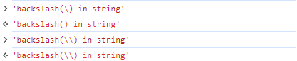

  - 한 문자열을 여러 줄로 표시하기 : `\n`을 사용하고, `alert()`도 사용해보기

    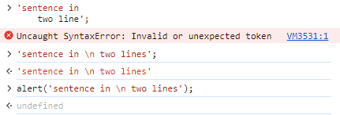
    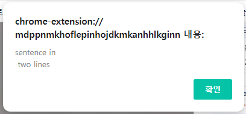

  - 템플릿 리터럴 사용하기 : backquote 사이의 문자열 \`...\` 을 사용하면 행갈이가 편하다.

    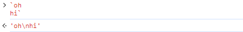

# Day 2

- 자료형 - 숫자
  
  - 웹사이트 DevTools에서 이진수, 16진수 등을 바로 확인할 수 있다니! 매우 유용할듯!
    ```
    > 0b11
    < 3
    > 0xabab
    < 43947
    ```
  
  - string to int : `parseInt()`, `parseFloat()`, `Number()`
  
    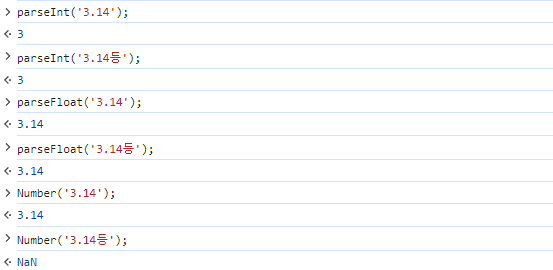
  
    `parseInt()` can be used to invert base of the numbers. [ 2진수 111 == 10진수 7 ] 이고, [ 7진수 111 == 10진수 57 ] 임을 생각해보면

    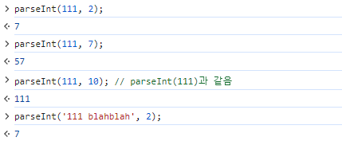

  - NaN
    
    `typeof NaN` ==> `'number'` ..?? OMG..
  
  - 무한값 `Infinity`

    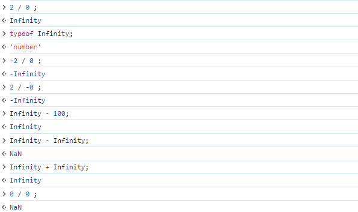

    이게뭐람

  - 문자와 숫자 더하기 : Type casting. 

    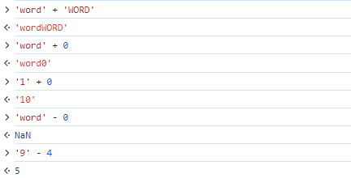

    \+는 append 느낌, \-는 진짜 빼기. JS는 엄청나군.

  - 연산자 우선순위
    
    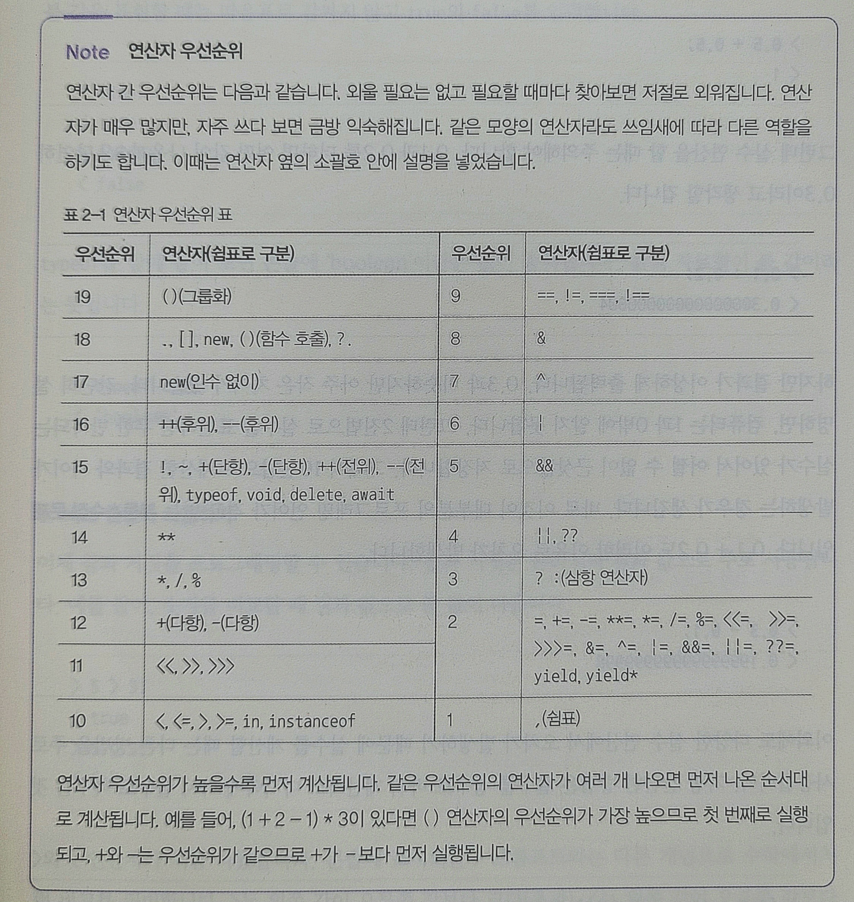

  - 실수 연산

    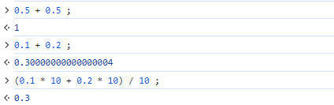

    (당연함)

- 자료형 - `Boolean`

  - `NaN`이 포함된 비교는 `!=`이 아니면 무조건 `false`다.

    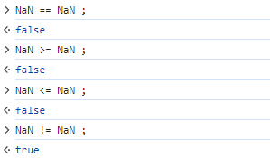

  - 자동 type casting

    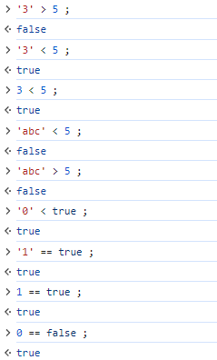

  - `.charCodeAt()` : char to ascii code

    ```
    > 'a'.charCodeAt();
    < 97
    ```
  
  - `==` 와 `===`

    자동 type casting 없이 비교하려면 `===`와 `!==`를 사용하면 된다.

  - falsy value : 형 변환 후 `false`가 되는 값. ex) `false`, `''`, `0`, `NaN`, `undefined`, `null` (<-> truthy value)
  
    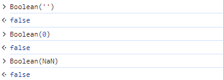

  - and operator `&&`, or operator `||`, nullish coalescing operator `??`
  
    - `x && y` : `y` if `x` is true, else `x`
    - `x || y` : `x` if `x` is true, else `y`
    - `x ?? y` : `y` if `x` is (null or undefined), else `x`

    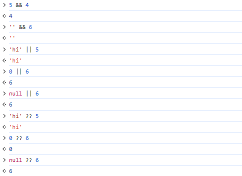
  
- 자료형 - 빈 값 사용하기

  - `undefined` : 값이자 자료형임 (`undefined`라는 type을 가진 값은 `undefined` 밖에 없음). 반환할 결과 값이 없을 때 `undefined`가 반환됨.
    
    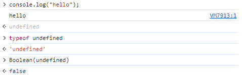

  - `null` : 값이자 자료형임 (`null`라는 type을 가진 값은 `null` 밖에 없음. 아래 codeset의 `typeof`의 결과는 JS의 고질적인 버그(??!!))

    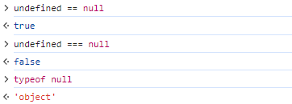
