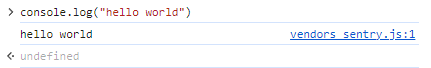

# Day 1
- JS 입문
  - 크롬 > `F12` > `Console`에서 인터프리터 방식으로 실행 가능
  - `console.log()`
  
    ```
    > console.log("Hello world");
    Hello world
    ```

    

- 코드 작성 규칙
  - 주석은 `//` 나 `/* ... */`로 처리
  - 들여쓰기는 C언어처럼. 편의를 위해서 들여쓰기.

- 자료형
  - `typeof` 연산자(operator)

    ```
    > typeof 'Hello, world'
    < 'string'
    ```

    

  - 비교 연산자 `==`

    ```
    > '' == ''
    < true
    > '' == ' '
    < false
    ```

  - 문자열 안에 따옴표 사용하기

    ```
    > 'backslash(\) in string'
    < 'backslash() in string'
    ```

    

  - 한 문자열을 여러 줄로 표시하기 : `\n`을 사용하고, `alert()`도 사용해보기

    
    

  - 템플릿 리터럴 사용하기 : backquote 사이의 문자열 \`...\` 을 사용하면 행갈이가 편하다.

    